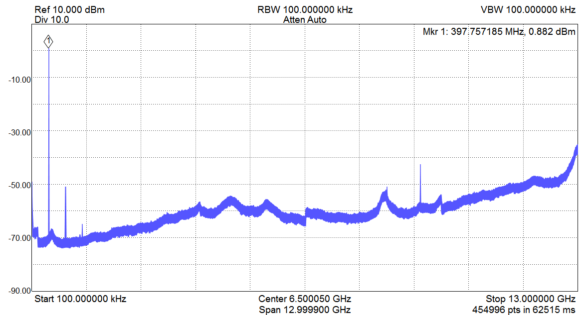
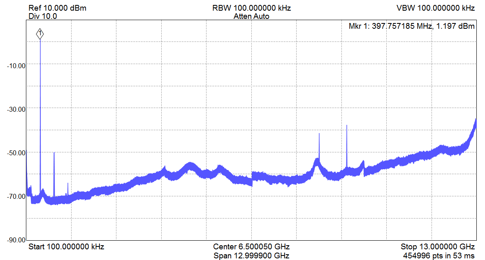
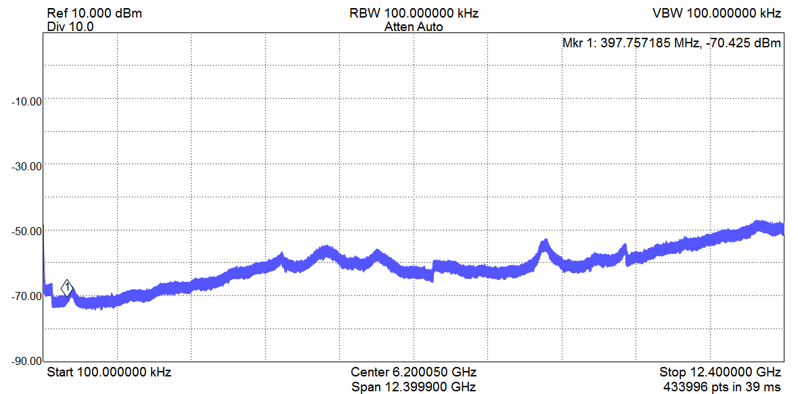

***************
Spectra
***************

In :numref:`fig_chan_a` and :numref:`fig_chan_b`, a broadband spectra of a 397.76 MHz sine wave is depicted.
The 1st harmonic is > 50 dB suppressed compared to the main frequency peak. The DAC's sampling rate can be seen in the spectrum at 8847.36 MHz.
The wavy background stems mainly from the used spectrum analyzer, compare with :numref:`fig_spectra_term` where the spectrum analyzer's input was terminated with 50 Ohm.

.. _fig_chan_a:

    Frequency spectrum of channel A set to 397.76 MHz and the amplitude to 1.

.. _fig_chan_b:

    Frequency spectrum of channel B set to 397.76 MHz and the amplitude to 1.

.. _fig_spectra_term:

    Frequency spectrum of the spectrum analyzer with a 50 Ohm terminated input.
